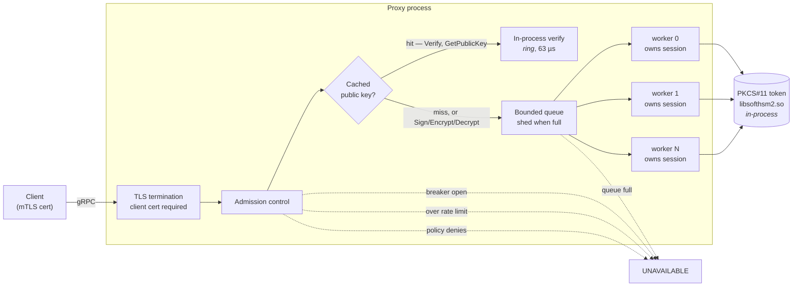

# gRPC-low-latency

A gRPC cryptographic proxy in front of a PKCS#11 token, built to answer one question:

> **How much throughput can you serve while keeping p99 latency under 2 milliseconds?**

Answer, measured on pinned cloud hardware: **20,000 requests/second at p99 = 1.15 ms**,
with mutual TLS, per-key authorization, and load shedding in the path.

---

## ⚠️ SoftHSM2 is not an HSM

This project runs against **SoftHSM2, a software token**. Key material sits in files on
disk protected by nothing more than filesystem permissions. There is no tamper-resistant
hardware, no secure element, and no attestation.

Everything here is about the *service architecture* around a PKCS#11 token — pooling,
caching, authorization, backpressure. None of it is about hardware key protection, and
none of the numbers below would transfer to a real HSM, whose per-operation cost and
concurrency behaviour are entirely different.

Do not reuse the demo PINs, certificates, or policy anywhere that matters.

---

## Quickstart

```bash
git clone https://github.com/DLtxt/gRPC-low-latency.git
cd gRPC-low-latency
make up          # generates PINs and certs, provisions the token, starts everything
make dash        # opens Grafana
```

That brings up the proxy, Prometheus, and a provisioned Grafana dashboard with live data
— no manual configuration. Then:

```bash
grpcurl -cacert certs/ca.crt -cert certs/payments.crt -key certs/payments.key \
  -d '{"keyLabel":"demo-ec-p256","mechanism":"SIGNATURE_MECHANISM_ECDSA_SHA256",
       "input":{"message":"aGVsbG8="}}' \
  localhost:50051 hsm.v1.HsmService/Sign
```

| Command | What it does |
|---|---|
| `make up` | Full stack: proxy, Prometheus, Grafana |
| `make bench` | Concurrency sweep; reports max QPS under the p99 budget |
| `make baseline` | Go direct-PKCS#11 baseline, three modes |
| `make ceiling` | The token's own limit, with no gRPC in the path |
| `make table` | Current best figures as markdown |
| `make records` | What the last run beat or regressed against |
| `make clean` | Tear down, including the token volume |

---

## Architecture



Admission control runs three checks in deliberate order — circuit breaker (one atomic
load), then authorization, then rate limit — so the cheapest rejection happens first and
we pay least for requests we are about to refuse.

### The worker pool

N dedicated OS threads, each owning **one PKCS#11 session for its entire life**, fed by a
single bounded channel.

`tokio::task::spawn_blocking` is deliberately not used: its pool grows on demand, threads
are not pinned, and — decisive here — its queue depth is invisible, which is the one
number this design must expose.

Each worker caches its own object handles. Handles are scoped to the session that found
them and cannot be shared, so per-worker caching is the only correct form. Without it
every request pays a `C_FindObjects`, measured at ~57 µs — roughly the cost of the ECDSA
signature itself.

### Why the token is not a separate container

PKCS#11 is an **in-process C API**. There is no network protocol and SoftHSM2 ships no
daemon, so the proxy cannot "connect to an HSM container" — it must `dlopen`
`libsofthsm2.so` into its own address space.

The resolution: an init container creates the token on a shared volume and exits; the
proxy image installs the same library and mounts the same volume. Only one process ever
writes the token directory, because concurrent writers corrupt it.

> Considered and rejected: `pkcs11-proxy` exposes PKCS#11 over TCP and would allow a
> genuinely network-separated token. It is effectively unmaintained and adds an
> unencrypted-by-default hop.

### Why `Sign` is never cached

Signing requires the private key, and the private key never leaves the token. Every
`Sign`, `Encrypt`, and `Decrypt` reaches the HSM, on every request, without exception.

Only **public** artifacts are cached — public keys and their DER encodings. That is what
makes `Verify` fast: once the public key is cached, verification happens entirely
in-process and the token is not in the path at all. No signature, plaintext, decrypt
result, or PIN is ever stored.

---

## Results

Generated from `results/` by `scripts/render-results.py` — no figure below is hand-typed.
Full record with conditions and ranking rules in [`best_results.md`](best_results.md).

### Throughput inside the 2 ms budget

| Workload | QPS within budget | p99 | Errors | Host | Setup |
|---|---|---|---|---|---|
| Sign `demo-ec-p256` (pool) | 20,000 | 1.15 ms | 22 (0.018%) | `c7g.2xlarge` | two-host, open loop |
| Verify `demo-ec-p256` (pool) | 17,260 | 1.69 ms | 0 | `c7g.2xlarge` | single-host, 4 workers |
| Sign `demo-ec-p256` (single session) | 5,675 | 1.76 ms | 0 | `c7i.2xlarge` | single-host, 8 workers |
| Sign `demo-rsa-2048` (pool) | 1,083 | 1.99 ms | 0 | `c7g.2xlarge` | single-host, 8 workers |
| Sign `demo-rsa-2048` (single session) | 761 | 1.60 ms | 0 | `c7i.2xlarge` | single-host, 8 workers |

Every row is a single run satisfying **both** constraints at once — the stated throughput
*with* that p99. Not a peak quoted beside a tail measured elsewhere.

### The three workloads behave differently, and the README says so

| Workload | HSM in path? | What it demonstrates |
|---|---|---|
| `sign-rsa` (RSA-2048) | every request | Worker pool scaling — the token is genuinely the bottleneck |
| `sign-ecdsa` (P-256) | every request | Proxy overhead — the token is *not* the bottleneck |
| `verify` (cached key) | no, once warm | Cache effectiveness — the HSM leaves the path |

Reporting one blended number across these would be misleading. ECDSA signing on this
token costs ~53 µs, so the proxy — not the HSM — is the constraint; quoting a speedup
there would be measuring the load generator. RSA-2048 costs ~725 µs, where the token
genuinely dominates and pooling produces a real gain.

### Load shedding under overload

| Offered | × capacity | Shed | Accepted throughput | p99 |
|---|---|---|---|---|
| 25,000 | 1.1× | 9% | ~22,700 QPS | 2.13 ms |
| 30,000 | 1.4× | 27% | ~21,900 QPS | 3.38 ms |
| 40,000 | 1.8× | 46% | ~21,700 QPS | 6.80 ms |
| 50,000 | 2.3× | 57% | ~21,500 QPS | 17.04 ms |

Accepted throughput holds at 21,000–22,000 QPS across a 2.3× range of offered load. The
service refuses excess rather than collapsing.

**Stated honestly:** accepted *latency* does degrade under sustained overload. Rejection
is cheap but not free — at 2.3× the server handles ~46,000 admission decisions per second
to serve ~21,500 requests. The claim this project makes is that throughput and error rate
stay bounded, not that latency stays flat.

### Adding threads to one session does not help

The Go baseline (`baseline/`) makes the architectural point in a language the proxy is
not written in, which removes the objection that the comparison is really "bad Rust
versus good Rust":

| Mode | Workers | ops/sec | p99 |
|---|---|---|---|
| `serial` | 1 | 3,315 | 1,208 µs |
| `naive-concurrent` (shared session) | 8 | 3,560 | **7,405 µs** |
| `pooled` (session per worker) | 8 | **7,642** | 6,624 µs |

Eight goroutines sharing one mutexed session gained 7% throughput and made p99 **six
times worse**. That is the problem the worker pool exists to solve.

---

## Methodology

Benchmark numbers are worthless without the conditions that produced them, so:

- **Published figures come from pinned cloud instances** — `c7g.2xlarge` (Graviton3) and
  `c7i.2xlarge` (Sapphire Rapids). Results from anywhere else are written to
  `results/local/` and labelled `local`; they never become published figures.
- **Every result file records its own host**: CPU model, core count, kernel, toolchain
  versions, git commit, and whether the tree was dirty.
- **Capacity and overload figures use two hosts**, proxy and load generator on separate
  machines. Sharing a host measures the two competing for CPU: it understated capacity by
  ~45%, and mean HSM service time rose 259 → 500 µs purely from starvation.
- **Open loop for anything involving shedding.** Closed-loop load refills as fast as the
  server rejects, so measured capacity becomes an artifact of how quickly it says no.
- **Median of three runs**, min–max spread reported. p99 sits close enough to 2 ms that
  single runs land on either side by chance.
- **Error counts printed beside every row.** Shed requests return in microseconds, so a
  run that rejects most of its load reports a *higher* QPS than one that serves it.

The laptop used for development drifted ~25% within a single session on unchanged code,
which is why none of its numbers are published. Details in
[`results/REFERENCE.md`](results/REFERENCE.md) and
[`docs/running-reference-benchmarks.md`](docs/running-reference-benchmarks.md).

---

## Security

**Authentication** is mutual TLS. The server requires a client certificate signed by the
configured CA, so an unauthenticated caller is refused during the handshake and never
reaches a handler. Identity is the certificate's SPIFFE URI SAN; Common Name is accepted
only as a warned fallback, because CN carries no structure and two issuers can mint the
same one.

**Authorization** is default-deny over `(identity, key_label, operation)`, from
[`policy/authz.toml`](policy/authz.toml). There are no wildcards on purpose: a wildcard
silently widens as new keys are added, which is exactly when it should stay narrow.

```toml
[[workloads]]
identity = "spiffe://local/ns/default/sa/reporting"
grants = [
    { key_label = "demo-ec-p256", operations = ["verify", "get_public_key"] },
]
```

The demo ships three identities, one deliberately under-privileged, so a real denial can
be demonstrated rather than described.

### Threat model

**In scope.** A caller reaching the gRPC endpoint who should not use a given key; a
caller with no valid certificate; a caller consuming more than their share of capacity; a
misbehaving client trying to exhaust the service.

**Out of scope.** Anything with code execution on the proxy host — the token is in the
proxy's address space, so that is game over by construction. Physical access. Compromise
of the CA. Side-channel attacks against SoftHSM2. Key material protection generally,
because SoftHSM2 is a software token.

**What the proxy actually buys you**: a single audited chokepoint where every key
operation is authenticated, authorized, rate-limited, and observable, instead of N
services each holding PKCS#11 credentials.

Certificates and PINs are generated locally by `make certs` and `make env`, are
gitignored, and have never been committed.

---

## Layout

```
proxy/          Rust: gRPC server, worker pool, cache, authz, resilience, telemetry
baseline/       Go: direct-PKCS#11 baseline, deliberately naive
proto/          hsm.v1 service definition
scripts/        benchmark harness, cert generation, host stamping, result rendering
deploy/         Prometheus config, provisioned Grafana dashboard
policy/         authorization policy
results/        benchmark output (reference/ tracked, local/ ignored)
docs/           per-milestone findings, including what did not work
```

## Documentation

| Document | Contents |
|---|---|
| [`best_results.md`](best_results.md) | Peak figures with conditions and ranking rules |
| [`plan.md`](plan.md) | The original design, with measured corrections in place |
| [`docs/reference-runs.md`](docs/reference-runs.md) | ARM vs x86 comparison |
| [`docs/m0-findings.md`](docs/m0-findings.md) … [`m8`](docs/m8-findings.md) | Per-milestone results, including measurement mistakes |

The `docs/` findings record what was wrong as well as what worked — a benchmark
contaminated by a background process, a cache that made things slower, metrics that were
declared but never recorded. Those are the parts worth reading.

## License

MIT
